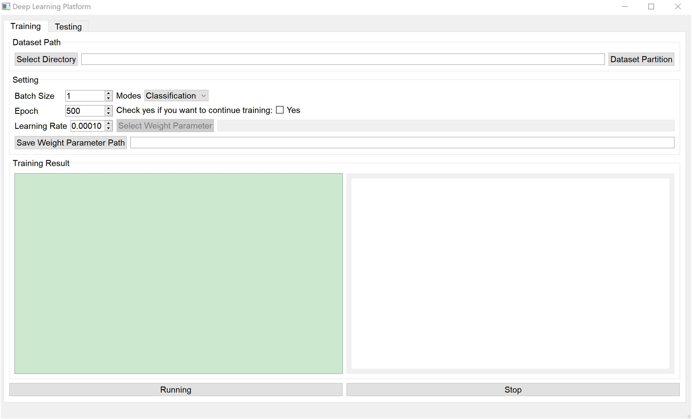
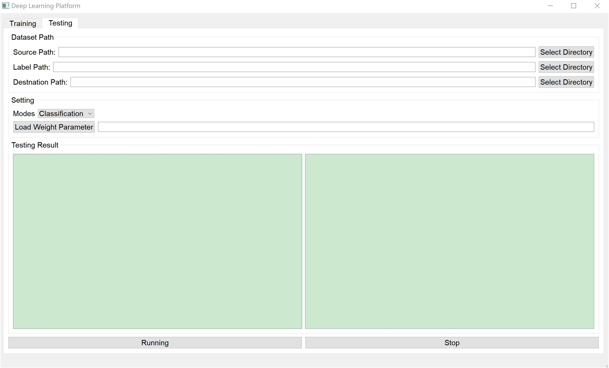

# 面向生物医学图像的可视化深度学习实验平台
一种面向生物医学图像的开源可视化深度学习实验平台。可视化深度学习实验平台包含训练模块和预测模块。训练模块利用已有数据集对网络模型进行训练。针对生物医学图像分类，目标检测和图像语义分割实验场景，平台分别集成三种不同类型的 深度神经网络 和损失函数以构建完整的端到端深度学习流程。模型预测模块利用训练好的网络模型对需要预测数据集进行推理，得到分类、检测和分割结果。此外，该模块可对包含金标准的测试数据的预测结果进行评价指标计算，从而对模型性能进行定量评估。

# 模型训练模块

 

训练模块的操作流程如下所述：

  **1.** 点击"Select Directory"按钮选取待训练数据集的存储路径(文件夹)，随后点击"Dataset Partition"按钮进行训练集和验证集的划分(默认划分比例：训练集80%，验证集20%)；

  **2.** 分别设置批处理尺寸，训练轮数和学习率等训练超参数并选取训练模式；平台提供图像分类，目标检测和图像分割三种训练模式，训练模式可通过下拉框选取；

  **3.** 点击"Save Weight Parameter Path"按钮选取模型权重参数的存储路径，平台自动存储训练过程中最优轮次和最优轮次的权重参数；最优轮次的权重参数用于模型推理，最近轮次的权重参数用于重启训练；

  **4.** 平台支持利用复选框重启训练，选取"Yes"后点击"Select Weight Parameter"按钮选取权重参数的存储路径(文件夹)；

   **5.** 点击底部"Running"按钮启动训练过程，平台支持文本和曲线图两种模式对训练损失和验证损失进行可视化；点击底部"Stop"按钮可终止训练过程；

# 模型预测模块

 

预测模块的操作流程如下所述：

  **1.** 分别点击"Select Directory"按钮选取原始图像，金标准和预测结果的存储路径(文件夹)；PS：某些任务可不选取金标准的存储路径

  **2.** 平台提供图像分类，目标检测和图像分割三种预测模式，训练模式可通过下拉框选取；

  **3.** 点击"Select Weight Parameter"按钮选取用于模型预测的最近轮次权重参数的存储路径(文件夹)；

   **5.** 点击底部"Running"按钮启动预测过程，平台自动计算预测结果与金标准标签间的差异，并采用文本和表格两种模式显示定量结果；
